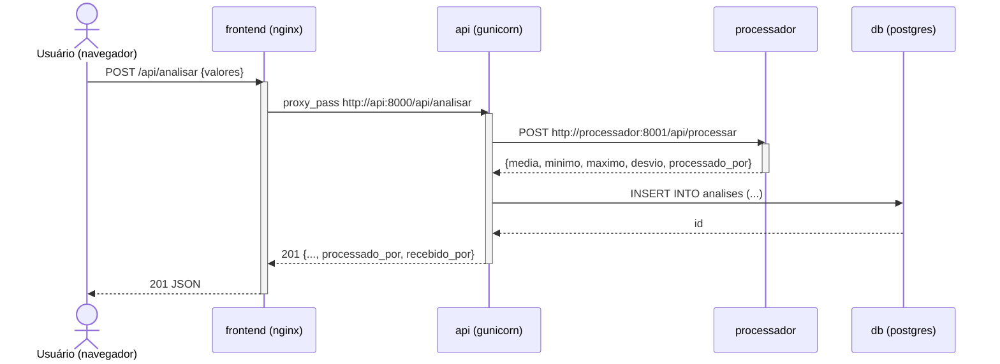
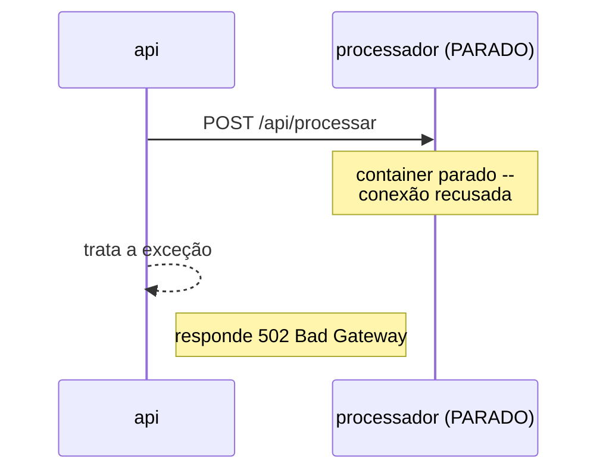
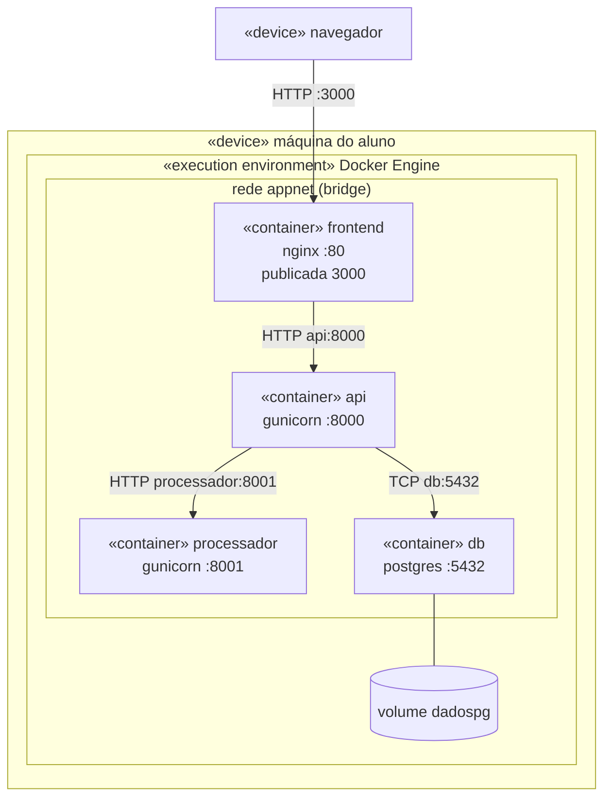

# UML — o que cai e como desenhar

UML tem **14 tipos de diagrama** na versão 2.x. Decorar os 14 é perda de tempo;
saber a **divisão** e dominar **3 deles** é o que resolve prova e ponderada.

A divisão é a primeira coisa a dizer numa resposta discursiva:

> Os diagramas UML se dividem em **estruturais** (o que o sistema *é*: partes e
> relações, visão estática) e **comportamentais** (o que o sistema *faz*:
> fluxo, ordem, estados, visão dinâmica).

---

## Os 14, em tabela

### Estruturais (7) — a fotografia

| Diagrama | Responde a |
|---|---|
| **Classes** | quais classes existem, seus atributos/métodos e como se relacionam |
| Objetos | como ficam as instâncias num instante concreto |
| Componentes | quais módulos/componentes existem e quais interfaces expõem |
| **Implantação** (deployment) | em quais nós/máquinas/containers cada artefato roda |
| Pacotes | como o código está agrupado em pacotes e o que depende de quê |
| Estrutura composta | como as partes internas de uma classe se conectam |
| Perfil | como estender a própria UML com estereótipos |

### Comportamentais (7) — o filme

| Diagrama | Responde a |
|---|---|
| Casos de uso | quem são os atores e o que cada um pode fazer |
| Atividades | qual é o fluxo do processo (parecido com fluxograma, com decisões e paralelismo) |
| Máquina de estados | em que estados um objeto pode estar e o que causa cada transição |
| **Sequência** | em que **ordem** as mensagens trocam entre os participantes |
| Comunicação | quem fala com quem (mesma informação da sequência, sem ênfase no tempo) |
| Visão geral de interação | junta vários diagramas de interação num fluxo |
| Temporização | como o estado muda ao longo de um eixo de tempo preciso |

> **Sequência vs comunicação:** mesma informação, ênfase diferente. Sequência
> destaca **quando** (eixo vertical = tempo). Comunicação destaca **quem com
> quem** (topologia). Isso é uma pegadinha comum de prova.

---

## 1. Diagrama de sequência (o mais pedido)

Serve para explicar **um** cenário: "o usuário clica em salvar — o que acontece,
em que ordem?".

### Elementos

| Elemento | Como aparece | Significa |
|---|---|---|
| Ator / Objeto | caixa no topo | participante (pessoa, sistema, serviço) |
| **Linha de vida** (lifeline) | linha vertical tracejada descendo da caixa | a existência do participante ao longo do tempo |
| **Barra de ativação** | retângulo estreito sobre a linha de vida | o participante está executando algo |
| Mensagem **síncrona** | seta de **ponta cheia** (▶) | o chamador **espera** a resposta |
| Mensagem **assíncrona** | seta de ponta **aberta** (→) | o chamador **não espera**, segue em frente |
| Retorno | seta **tracejada** de volta | a resposta |
| Autochamada | seta que sai e volta no mesmo participante | o objeto chama um método dele mesmo |
| `X` no fim da linha | destruição | o objeto deixou de existir |

### Fragmentos combinados (as "caixinhas" com rótulo)

| Rótulo | Uso |
|---|---|
| `alt` | alternativa: if/else — vários compartimentos com condições de guarda |
| `opt` | opcional: só executa se a condição for verdadeira (if sem else) |
| `loop` | repetição |
| `par` | paralelo: os compartimentos acontecem ao mesmo tempo |
| `break` | interrompe o fluxo (tratamento de exceção) |
| `ref` | referência a outro diagrama de sequência, para não repetir |
| `critical` | região que não pode ser interrompida |

### Exemplo — a stack deste repositório

Este é literalmente o fluxo do `POST /api/analisar`:

**Por que esse diagrama é ouro na ponderada:** ele é, ao mesmo tempo, o
diagrama de sequência e a **prova de que você entendeu a comunicação entre
serviços**. Os nomes `api`, `processador`, `db` nas setas são exatamente os
nomes de serviço resolvidos pelo DNS do Compose.

Versão com falha (para mostrar o teste negativo):

### Erros que derrubam nota

- Esquecer a **barra de ativação** e as setas de **retorno**.
- Usar ponta cheia (síncrona) para tudo, inclusive para evento de fila/webhook.
- Escrever o fluxo inteiro do sistema num diagrama só. **Um cenário por
  diagrama.**
- Pôr nome de classe onde o enunciado pediu nome de serviço (ou vice-versa).

---

## 2. Diagrama de classes

### Multiplicidade

| Notação | Leitura |
|---|---|
| `1` | exatamente um |
| `0..1` | zero ou um (opcional) |
| `*` ou `0..*` | zero ou muitos |
| `1..*` | um ou muitos |

### Relações — a tabela que cai na prova

| Relação | Símbolo | Significado | Exemplo |
|---|---|---|---|
| Associação | linha simples | os dois se conhecem | `Pedido — Cliente` |
| Agregação | losango **vazio** ◇ | "tem um", mas a parte **sobrevive** ao todo | `Time ◇— Jogador` (o jogador existe sem o time) |
| **Composição** | losango **cheio** ◆ | "é feito de", e a parte **morre** com o todo | `Pedido ◆— ItemDePedido` (o item não existe sem o pedido) |
| Herança / generalização | triângulo vazio △ | "é um tipo de" | `Gerente △— Funcionário` |
| Realização | triângulo vazio + linha tracejada | implementa uma interface | `RepoPostgres ⇢△ Repositorio` |
| Dependência | seta tracejada | usa temporariamente | `Servico ⇢ Logger` |

> A pergunta de prova é quase sempre **agregação vs composição**. O teste é:
> *se eu apagar o todo, a parte continua existindo?* Sim → agregação ◇.
> Não → composição ◆.

### Visibilidade

| Símbolo | Visibilidade |
|---|---|
| `+` | pública |
| `-` | privada |
| `#` | protegida |
| `~` | pacote |

Atributo sublinhado = estático (de classe, não de instância).

---

## 3. Diagrama de implantação — a ponte com Docker ⭐

É aqui que UML e a ponderada se encontram. O diagrama de implantação mostra
**nós** (máquinas, ambientes de execução) e os **artefatos** que rodam dentro
deles.

| Conceito UML | Na sua stack |
|---|---|
| **Nó** (`<<device>>`) | a máquina que roda o Docker |
| **Ambiente de execução** (`<<execution environment>>`) | o Docker Engine |
| Nó aninhado (`<<container>>`) | cada container: `frontend`, `api`, `processador`, `db` |
| **Artefato** | a imagem/aplicação dentro do container |
| Caminho de comunicação | a rede `appnet`, anotada com o protocolo e a porta |

Esboço:

Três coisas para **anotar no diagrama**, porque são exatamente o que o professor
avalia:

1. **Qual porta é publicada** (só a do `frontend`) e qual é só interna.
2. **O nome usado em cada seta** — nome de serviço, não `localhost` nem IP.
3. **Onde está o volume**, para mostrar que a persistência foi pensada.

---

## 4. Como responder uma questão de UML na discursiva

Mesma receita das questões de Docker:

1. **Classifique**: "é um diagrama comportamental, de sequência, porque o
   enunciado pergunta a *ordem* das interações."
2. **Liste os participantes** que o enunciado dá (eles estão escondidos no
   texto: cada substantivo de sistema é uma linha de vida).
3. **Desenhe/descreva as mensagens em ordem**, dizendo quais são síncronas e
   por quê.
4. **Trate o caminho de erro** com um `alt` ou `break`. Quase ninguém faz isso,
   e é o que diferencia a resposta.

Se a questão pedir texto e não desenho, descreva em lista numerada: "1. o
navegador envia `POST /api/analisar` ao `frontend` (síncrona, pois aguarda a
resposta); 2. o `frontend` repassa via `proxy_pass` para `api:8000`; ...".

---

Continua em [padroes-de-projeto.md](padroes-de-projeto.md).
